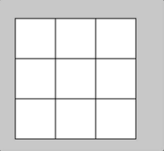

# Compound Operators Cardio

Complete the tasks outlined below!

## Tasks

**CHALLENGE 1**: When the mouse is near the center of the screen, draw a circle at a random position. Draw nothing when it is outside this area.

**CHALLENGE 2**: Create code that colors in a square with a red fill when the mouse is touching it. Otherwise, the fill is set to white.

**CHALLENGE 3**: Update the code with a second button that turns blue when the mouse is touching the square.

**CHALLENGE 4**: Design a grid such that each square lights up with a different color as you mouse moves across them. 

**Ready for a stretch?** Get them to turn color when they are clicked. Google "click p5" and you should find some documentation.

